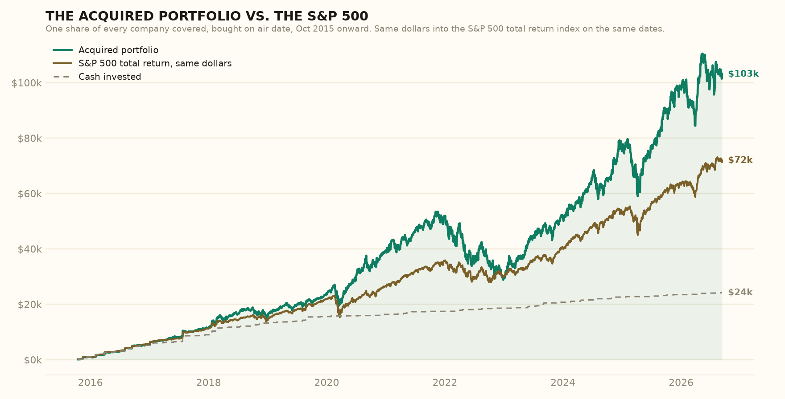

# Acquired Portfolio Sim

Every episode of the [Acquired](https://www.acquired.fm) podcast opens with the same line: "this is not investment advice."

What if it were?

This project answers a simple question. If you had bought one share of every publicly traded company Acquired has ever covered, on the day that episode came out, what would you have today?



## The answer

| | Acquired portfolio | S&P 500, same dollars, same dates |
|---|---|---|
| Total put in | $24,130 | $24,130 |
| Worth today | $102,977 | $71,860 |
| Multiple | 4.27x | 2.98x |
| Annual return | 20.5% | 15.4% |

As of the 11 September 2026 close. The annual return is money-weighted, meaning it accounts for the fact that cash went in gradually over eleven years rather than all at once.

Of 169 main-feed episodes, 114 produced a purchase. The other 55 were about private companies like SpaceX, Stripe, and Epic Games, or were not about a company at all.

**Explore the full interactive report, with every episode and a sortable table:**
https://claude.ai/code/artifact/d36bbe9e-bbc7-4918-b4c8-37a264c92934

## Where the money came from

One share means one share. That makes the result lopsided toward whatever was expensive on the day it aired.

**The big winners**

| Episode | Bought | Cost | Worth today |
|---|---|---|---|
| YouTube (Alphabet) | Feb 2016 | $749 | $6,834 |
| Google Docs (Alphabet) | Mar 2016 | $766 | $6,834 |
| Android (Alphabet) | Sep 2016 | $798 | $6,834 |
| Waze (Alphabet) | Aug 2016 | $799 | $6,834 |
| Tesla | Jul 2018 | $310 | $5,482 |
| Twitch (Amazon) | Nov 2015 | $648 | $5,136 |

Six pre-split Alphabet episodes from 2016 to 2019 account for roughly $35,000 of the $79,000 total gain. Apple's six early episodes each grew more than tenfold. Nvidia's three-part series bought in at $214 to $485 a share, and each of those shares is now worth about $2,300.

**The big losers**

| Episode | Bought | Cost | Worth today |
|---|---|---|---|
| Hermès | Feb 2024 | $240 | $167 |
| Nike | Jul 2023 | $109 | $40 |
| LVMH | Feb 2023 | $171 | $103 |
| Meituan | Mar 2021 | $81 | $19 |
| Porsche | Jun 2023 | $119 | $58 |
| Novo Nordisk | Jan 2024 | $105 | $47 |

The 2023 to 2024 run of luxury and consumer episodes has not gone well. Virgin Galactic lost 99 percent. Peloton lost 86 percent.

## How the simulation works

The rules were written down before any numbers were run, and every judgment call since has been logged. The full list is in [rules.md](rules.md). The short version:

- **Main feed only.** No interviews, specials, or live shows.
- **One share, bought at the close on the air date.** If an episode aired on a weekend, the share was bought at the next close.
- **Multi-part series buy again.** Nvidia Parts I, II, and III are three purchases.
- **If the subject had already been acquired, buy the acquirer.** Instagram means Meta. Pixar means Disney. Skype means Microsoft. If the acquirer later sold that business, the share is sold that day.
- **Private companies are skipped** but counted, because they are part of the story.
- **Dividends are reinvested.** Cash from buyouts sits at zero interest. Stock deals convert at the exchange ratio.
- **The benchmark is fair.** The same dollars go into the S&P 500 total return index on the same dates, so a slow drip of purchases is compared against a slow drip of index buys.

## How much to trust it

More than a back-of-envelope, less than an audited fund report.

- The episode list, ticker mapping, and corporate actions were researched by AI agents and then independently checked by a second adversarial pass. That review re-verified every merger and spin-off, reproduced the benchmark and return figures from scratch, and caught one real bug in cost basis that has since been fixed. Its notes are in the [review](review/) folder.
- Nine companies were later taken private or delisted, and free price data for them no longer exists. Their prices were hand-researched at a few points and interpolated between them. They are flagged in the results.
- No taxes, trading fees, or interest on idle cash are modeled.
- The Sony position ignores a small spin-off. A few other rounding-level simplifications are listed in the rules.

## Run it yourself

Everything is reproducible from public data. Corrections belong in the CSV files, not the script.

```bash
python3 -m venv .venv && .venv/bin/pip install pandas yfinance matplotlib
.venv/bin/python backtest.py --selftest
.venv/bin/python backtest.py
.venv/bin/python build_report.py
```

| File | What it is |
|---|---|
| `rules.md` | Every methodology decision, numbered. Start here. |
| `episodes.csv` | One row per episode: subject, ticker, parent company, status, source. |
| `events.csv` | Buyouts and divestitures that happened after purchase. |
| `manual_prices.csv` | Hand-researched prices for delisted companies. |
| `backtest.py` | Pulls prices, runs the simulation, writes the results and chart. |
| `build_report.py` | Fills the interactive HTML report from the results. |
| `results.csv` | The per-episode outcome table. |
| `review/` | The adversarial review and an independent recomputation. |

## The fine print

This is an unofficial fan project. It is not affiliated with, endorsed by, or connected to Acquired, Ben Gilbert, or David Rosenthal.

It is a backtest of a joke. Buying one share of everything a podcast talks about is not a strategy, and past performance says nothing about the future. This is not investment advice.
